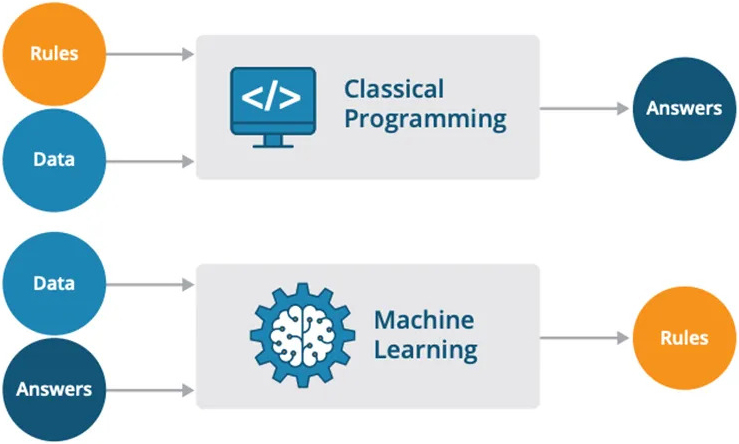

Introduction to Machine Learning
================================

.. questions::

   - What is Machine Learning?
   - What is the relationship between AI, ML, and DL?
   - Why should we embrance ML at the current stage?

.. objectives::

   - Describe a general description of ML
   - Clarify the relationship between AI, ML, and DL
   - Get familiar with representative real-word applications of ML

What is Machine Learning
------------------------

Machine learning (ML) is a field of computer science that studies algorithms and techniques for automating solutions to complex problems that are hard to program using conventional programing methods.

In conventional programming, the programmer explicitly codes the logic (rules) to transform inputs (data) into outputs (answers), making it suitable for well-defined, rule-based tasks. In ML, the system learns the logic (rules) from data and answers, making it ideal for complex, pattern-based tasks where explicit rules are hard to define. The choice between them depends on the problem, data availability, and complexity.

   The difference between conventional programing and machine learning.

Relation with Artificial Intelligence and Deep Learning
-------------------------------------------------------

Artificial Intelligence (AI) is the broadest field, encompassing any technique that enables computers to mimic human intelligence, such as reasoning, problem-solving, perception, and decision-making. AI includes a wide range of approaches, from rule-based systems (like expert systems) to modern data-driven methods. It aims to create systems that can perform tasks that typically require human intelligence, such as playing chess, recognizing images, or understanding language.

ML is a subset of AI that focuses on algorithms and models that learn patterns from data to make predictions or decisions without being explicitly programmed. ML is one of the primary ways to achieve AI. It enables systems to improve performance over time by learning from experience (data) rather than relying solely on hardcoded rules. ML includes various techniques like supervised learning (*e.g.*, regression, classification), unsupervised learning (*e.g.*, clustering, dimensionality reduction), and reinforcement learning.

Deep Learning (DL) is a specialized subset of ML that uses neural networks with many layers (hence "deep") to model complex patterns in large datasets. DL is a subset of ML, and it leverages artificial neural networks inspired by the human brain to tackle tasks like image recognition, speech processing, and natural language understanding. DL excels in handling unstructured data (*e.g.*, images, audio, text) and requires significant computational power and large datasets for training.

.. figure:: img/relationship-AI-ML-DL.png
   :align: center
   :width: 512px

   The relationship between artificial intelligence, machine learning, and deep learning.

Why Machine Learning?
---------------------

ML is transforming how we solve complex problems in the real world by enabling systems to learn directly from data, rather than relying on explicitly programmed rules. In many real-world scenarios, such as medical diagnosis, stock market prediction, or natural language processing, the relationships between inputs and outputs are too complex or dynamic to define manually. ML models can uncover hidden patterns and make accurate predictions or decisions, making them essential tools in fields like healthcare, finance, transportation, and cybersecurity.

Another crucial advantage of ML is its ability to adapt and improve over time as more data becomes available. Unlike traditional rule-based systems that require constant manual updates, ML models can retrain and adjust themselves to new data, trends, or anomalies, ensuring that the system stays relevant and effective. For example, in fraud detection, ML algorithms can evolve as fraud tactics change, providing a stronger defense compared to static rules that may become outdated. This adaptability makes ML particularly powerful in dynamic, real-time environments where traditional programming methods fall short.

In addition, ML empowers the automation of complex tasks that were previously dependent on human expertise and intuition. From voice recognition in virtual assistants to autonomous driving, ML algorithms can process vast amounts of unstructured data such as text, images, and audio, which are traditionally challenging for computers to handle. By enabling machines to "learn" from experience and improve their performance over time, ML not only enhances productivity but also opens new frontiers for innovation across industries, creating smarter systems that can make meaningful contributions to society.

ML Applications and Importance
------------------------------

Problems can be solve with ML
^^^^^^^^^^^^^^^^^^^^^^^^^^^^^

ML is used across a wide range of industries and real-world problems in healthcare, finance, natural language processing, computer vision, transportation, manufacturing industry, retail, and cybersecurity.

Below are key categories of problems that can be applied using ML.

.. list-table::  
   :widths: 100 500
   :header-rows: 1

   * - Application area
     - Example use Cases
   * - Healthcare
     - Disease prediction & diagnosis, medical image analysis, drug discovery
   * - Finance
     - Fraud detection, credit scoring, algorithmic trading
   * - Retail & e-commerce
     - Product recommendations, customer segmentation, demand forecasting
   * - Transportation and autonomous systems
     - Self-driving cars, traffic prediction, route optimization
   * - Natural language processing (NLP)
     - Chatbots and virtual assistants, sentiment analysis, language translation
   * - Manufacturing & industry
     - Predictive maintenance, quality control, supply chain optimization
   * - Computer Vision
     - Facial recognition, object detection, image classification

