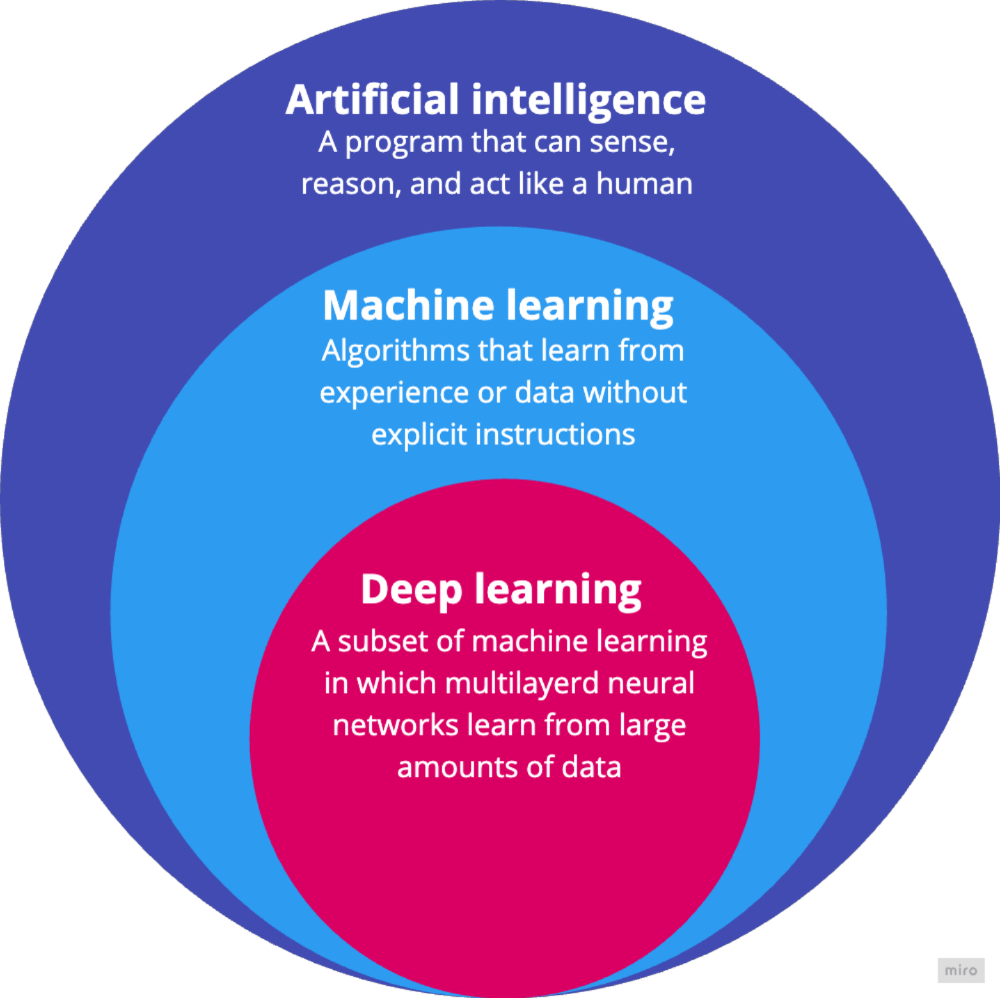

Introduction to Machine Learning
================================

.. questions::

   - What is Machine Learning?
   - What is the relationship between AI, ML, and DL?

.. objectives::

   - Describe a general description of ML
   - Clarify the relationship between AI, ML, and DL

What is Machine Learning
------------------------

Machine learning (ML) is a field of computer science that studies algorithms and techniques for automating solutions to complex problems that are hard to program using conventional programing methods.

In conventional programming, the programmer explicitly codes the logic (rules) to transform inputs (data) into outputs (answers), making it suitable for well-defined, rule-based tasks. In ML, the system learns the logic (rules) from data and answers, making it ideal for complex, pattern-based tasks where explicit rules are hard to define. The choice between them depends on the problem, data availability, and complexity.

   The difference between conventional programing and machine learning.

Relation with Artificial Intelligence and Deep Learning
-------------------------------------------------------

Artificial Intelligence (AI) is the broadest field, encompassing any technique that enables computers to mimic human intelligence, such as reasoning, problem-solving, perception, and decision-making. AI includes a wide range of approaches, from rule-based systems (like expert systems) to modern data-driven methods. It aims to create systems that can perform tasks that typically require human intelligence, such as playing chess, recognizing images, or understanding language.

ML is a subset of AI that focuses on algorithms and models that learn patterns from data to make predictions or decisions without being explicitly programmed. ML is one of the primary ways to achieve AI. It enables systems to improve performance over time by learning from experience (data) rather than relying solely on hardcoded rules. ML includes various techniques like supervised learning (*e.g.*, regression, classification), unsupervised learning (*e.g.*, clustering, dimensionality reduction), and reinforcement learning.

Deep Learning (DL) is a specialized subset of ML that uses neural networks with many layers (hence "deep") to model complex patterns in large datasets. DL is a subset of ML, and it leverages artificial neural networks inspired by the human brain to tackle tasks like image recognition, speech processing, and natural language understanding. DL excels in handling unstructured data (*e.g.*, images, audio, text) and requires significant computational power and large datasets for training.

	The relationship between artificial intelligence, machine learning, and deep learning.

