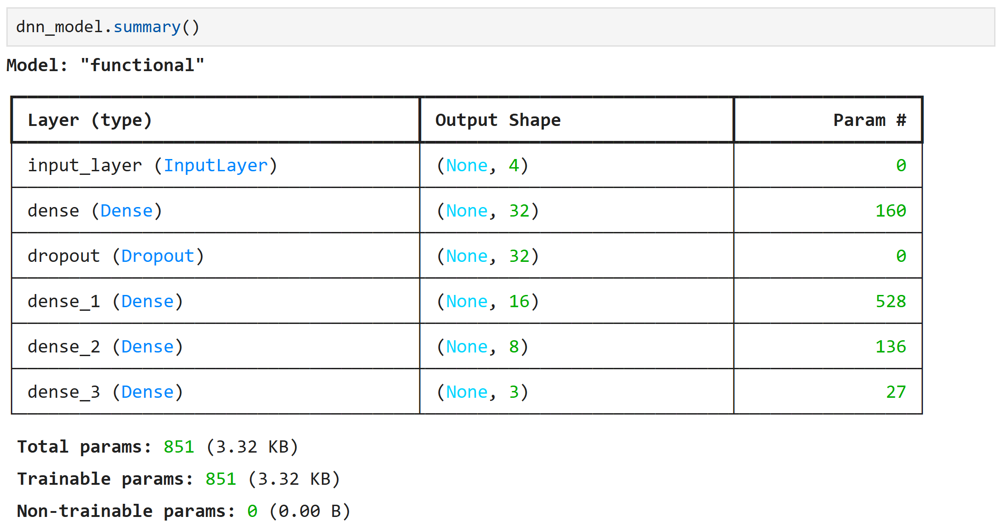

Supervised Learning (I): Classification
=================================

.. questions::

   - why 

.. objectives::

   - Explain 

.. instructor-note::

   - 40 min teaching
   - 40 min exercises

Classification is a supervised ML task where the model predicts discrete class labels based on input features. It involves training a model on labeled data so that it can assign new data to predefined categories or classes based on patterns learned from labeled training data.

In binary classification, models predict one of two classes, such as spam or not spam for emails. Multiclass classification extends this to multiple categories, like classifying images as cats, dogs, or birds.

Common algorithms for classification task include k-Nearest Neighbors (KNN), Logistic Regression, Naive Bayes, Support Vector Machine (SVM), Decision Tree, Random Forest, Gradient Boosting, and Neural Networks.

In this episode we will perform supervised classification tasks to categorize penguins into three species -- Adelie, Chinstrap, and Gentoo -- based on their physical measurements (flipper length, body mass, *etc.*). We will build and train multiple classifier models as mentioned above. Each model will be evaluated using appropriate performance metrics like accuracy, precision, recall, and F1 score. By comparing the results across models, we aim to identify which classifier model provides the most accurate and reliable classification for this task.

.. figure:: img/4-penguins-categories.png
   :align: center
   :width: 640px

   The Palmer Penguins data were collected from 2007-2009 by Dr. Kristen Gorman with the `Palmer Station Long Term Ecological Research Program <https://lternet.edu/site/palmer-antarctica-lter/>`_, part of the `US Long Term Ecological Research Network <https://lternet.edu/>`_. The data were imported directly from the `Environmental Data Initiative (EDI) <https://edirepository.org/>`_ Data Portal, and are available for use by CC0 license (“No Rights Reserved”) in accordance with the `Palmer Station Data Policy <https://lternet.edu/data-access-policy/>`_.

Importing Dataset
-----------------

Seaborn provides the Penguins dataset through its built-in data-loading functions. We can access it using ``sns.load_dataset('penguin')`` and then have a quick look at the data:

.. code-block:: python

   import numpy as np
   import matplotlib.pyplot as plt
   import pandas as pd
   import seaborn as sns

   penguins = sns.load_dataset('penguins')
   penguins

.. csv-table::
   :widths: auto
   :delim: ;

   ; species; island; bill_length_mm; bill_depth_mm; flipper_length_mm; body_mass_g; sex
   0; Adelie; Torgersen; 39.1; 18.7; 181.0; 3750.0; Male
   1; Adelie; Torgersen; 39.5; 17.4; 186.0; 3800.0; Female
   2; Adelie; Torgersen; 40.3; 18.0; 195.0; 3250.0; Female
   3; Adelie; Torgersen; NaN; NaN; NaN; NaN; NaN
   4; Adelie; Torgersen; 36.7; 19.3; 193.0; 3450.0; Female
   ...; ...; ...; ...; ...; ...; ...; ...
   339; Gentoo; Biscoe; NaN; NaN; NaN; NaN; NaN
   340; Gentoo; Biscoe; 46.8; 14.3; 215.0; 4850.0; Female
   341; Gentoo; Biscoe; 50.4; 15.7; 222.0; 5750.0; Male
   342; Gentoo; Biscoe; 45.2; 14.8; 212.0; 5200.0; Female
   343; Gentoo; Biscoe; 49.9; 16.1; 213.0; 5400.0; Male

There are seven columns include:

- *species*: penguin species (Adelie, Chinstrap, Gentoo)
- *island*: island where the penguin was found (Biscoe, Dream, Torgersen)
- *bill_length_mm*: length of the bill
- *bill_depth_mm*: depth of the bill
- *flipper_length_mm*: length of the flipper
- *body_mass_g*: body mass in grams
- *sex*: male or female

Looking at numbers from ``penguins`` and ``penguins.describe()`` usually does not give a very good intuition about the data we are working with, we have the preference to visualize the data.

One nice visualization for datasets with relatively few attributes is the Pair Plot, which can be created using ``sns.pairplot(...)``. It shows a scatterplot of each attribute plotted against each of the other attributes. By using the ``hue='species'`` setting for the pairplot the graphs on the diagonal are layered kernel density estimate plots for the different values of the ``species`` column.

.. code-block:: python

   sns.pairplot(penguins_classification[["species", "bill_length_mm", "bill_depth_mm", "flipper_length_mm", "body_mass_g"]], hue="species", height=2.0)

.. figure:: img/4-penguins-pairplot.png
   :align: center
   :width: 640px

.. challenge:: Discussion

   Take a look at the pairplot we created. Consider the following questions:

   - Is there any class that is easily distinguishable from the others?
   - Which combination of attributes shows the best separation for all 3 class labels at once?
   - (optional) Create a similar pairplot, but with ``hue="sex"``. Explain the patterns you see. Which combination of features distinguishes the two sexes best?

   .. solution::

     1. The plots show that the green class (Gentoo) is somewhat more easily distinguishable from the other two.
     2. Adelie and Chinstrap seem to be separable by a combination of bill length and bill depth (other combinations are also possible such as bill length and flipper length).
     3. ``sns.pairplot(penguins_classification, hue="sex", height=2.0)``. From the plots you can see that for each species females have smaller bills and flippers, as well as a smaller body mass. You would need a combination of the species and the numerical features to successfully distinguish males from females. The combination of bill_depth_mm and body_mass_g gives the best separation.

Data Processing
---------------

Handling missing values and outliers
^^^^^^^^^^^^^^^^^^^^^^^^^^^^^^^^^^^^

For a ML task, the input data (features) and target data (label) are not yet in a right format to use. We need to pre-process the data (as what we did yesterday) to clean missing values using ``penguins_classification = penguins.dropna()`` and check duplicate values using ``penguins_classification.duplicated().value_counts()``.

It is noted that we don't have outliers in this dataset (as we have discussed this issue in the `data processing <>`_ tutorial). For the other datasets you use for the first time, you should check if there are outliers for some features in the dataset, and then take steps to handle the outliers, either to imputate outliers with mean/median values or to remove abnormal outliers for simplicity.

Encoding categorical variables
^^^^^^^^^^^^^^^^^^^^^^^^^^^^^^

In the classification task, we will use the categorical variable *species* as the label (target variable), and other columns as features to predict the species of penguins.

.. challenge:: Discussion

   - why to use *species*?
   - why not to use other other categorical variables (here it would be *island* and *sex*)?

   .. solution::

     1. *species* will be the main biological classification target in this dataset as it 3 distinct classes (Adelie, Chinstrap, and Gentoo). This is commonly used in ML tutorials as a multi-class classification example (similar to the `Iris dataset <https://archive.ics.uci.edu/dataset/53/iris>`_).
     2. *island* is not a ideal label as it is just geographical info, not a biological classification target; *sex* is possible but quite limited. This variable only has two classes (only for binary classification), and the data is unbalanced and has missing values.

It is noted that ML models cannot directly process categorical (non-numeric) data, so we have to encode categorical variables like *species*, *island*, and *sex* into numerical values. Here we use ``LabelEncoder`` from ``sklearn.preprocessing`` to convert the species column, which serves as our classification target. The ``LabelEncoder`` assigns a unique integer to each species: "Adelie" becomes 0, "Chinstrap" becomes 1, and "Gentoo" becomes 2. This transformation allows classification algorithms to treat the species labels as distinct, unordered classes.

Then we apply the same rule to encode the island and sex columns. Although these are typically better handled with one-hot encoding due to their nominal nature, we use ``LabelEncoder`` here for simplicity and compact representation. Each unique category in island (*e.g.*, "Biscoe", "Dream", "Torgersen") and sex (*e.g.*, "Male", "Female") is mapped to a unique integer. This enables us to include them as input features in the model without manual transformation. However, it’s important to note that ``LabelEncoder`` introduces an implicit ordinal relationship, which might not always be appropriate -- in such cases, ``OneHotEncoder`` is preferred.

.. code-block:: python

   from sklearn.preprocessing import LabelEncoder

   encoder = LabelEncoder()

   # encode "species" column with 0=Adelie, 1=Chinstrap, and 2=Gentoo
   penguins_classification.loc[:, 'species'] = encoder.fit_transform(penguins_classification['species'])

   # encode "island" column with 0=Biscoe, 1=Dream and 2=Torgersen
   penguins_classification.loc[:, 'island'] = encoder.fit_transform(penguins_classification['island'])

   # encode "sex" with column 0=Female and 1=Male
   penguins_classification.loc[:, 'sex'] = encoder.fit_transform(penguins_classification['sex'])

Data Splitting
--------------

Splitting features and labels
^^^^^^^^^^^^^^^^^^^^^^^^^^^^^

In preparing the penguins dataset for classification, we first need to split the data into features and labels. The target variable we aim to predict is the penguin species, which we encode into numeric labels using ``LabelEncoder``. This encoded species column will be the **label vector** (*e.g.*, **y**). The remaining columns -- such as bill length, bill depth, flipper length, body mass, and encoded categorical variables like island and sex -- constitute the **feature matrix** (*e.g.*, **X**). These features contain the input information the model will learn from.

Separating features (X) from labels (y) ensures a clear distinction between what the model uses for prediction and what it is trying to predict.

.. code-block:: python

   X = penguins_classification.drop(['species'], axis=1)
   y = penguins_classification['species'].astype('int')

Splitting training and testing sets
^^^^^^^^^^^^^^^^^^^^^^^^^^^^^^^^^^^

After separating features and labels in the penguins dataset, we further divide the data into a training set and a testing set. The training set is used to train the model, allowing it to learn patterns and relationships from the data, and the test set, on the other hand, is reserved for evaluating the model’s performance on unseen data. A common split is 80% for training and 20% for testing, which provides enough data for training while still retaining a meaningful test set.

This splitting is typically done using the ``train_test_split`` function from ``sklearn.model_selection``, with a fixed ``random_state`` to ensure reproducibility.

.. code-block:: python

   from sklearn.model_selection import train_test_split

   X_train, X_test, y_train, y_test = train_test_split(X, y, test_size=0.2, random_state=123)

   print(f"Number of examples for training is {len(X_train)} and test is {len(X_test)}")

Feature scaling
^^^^^^^^^^^^^^^

Before training, it is also essential to ensure that numerical features are properly scaled via applying standardization or normalization -- especially for distance-based or gradient-based models -- to achieve optimal results.

.. code-block:: python

   from sklearn.preprocessing import StandardScaler
   
   # Standardize features
   scaler = StandardScaler()

   X_train_scaled = scaler.fit_transform(X_train)
   X_test_scaled = scaler.transform(X_test)

Training Model & Evaluating Model Performance
---------------------------------------------

After preparing the Penguins dataset by handling missing values, encoding categorical variables, and splitting it into features-labels and training-test datasets, the next step is to apply classification algorithms including k-Nearest Neighbors (KNN), Naive Bayes, Decision Trees, Random Forests, and Neural Networks to predict penguin species based on their physical measurements. Each algorithm offers a unique approach to pattern recognition and generalization, and applying them to the same prepared dataset allows for a fair comparison of their predictive performance.

Below is the generic steps for representative algorithms we will use to training a model for penguins classification:

- choosing a model class and importing that model ``from sklearn.neighbors import XXX``
- choosing the model hyperparameters by instantiating this class with desired values ``xxx_model = XXX(<... hyperparameters ...>)``
- training the model to the preprocessed train data by calling the ``fit()`` method of the model instance ``xxx_model.fit(X_train_scaled, y_train)``
- making predictions using the trained model on test data ``y_pred_xxx = xxx_model.predict(X_test_scaled)``
- evaluating model’s performance using available metrics ``score_xxx = accuracy_score(y_test, y_pred_xxx)``
- (optional) data visualization of confusion matrix and relevant data

k-Nearest Neighbors (KNN)
^^^^^^^^^^^^^^^^^^^^^^^^^

One intuitive and widely-used method is the KNN algorithm. KNN is a non-parametric, instance-based algorithm that predicts a sample's label based on the majority class of its *k* closest neighbors in training set. **KNN does not require training in the traditional sense; instead, it stores the entire dataset and performs computation during prediction time. This makes it a lazy learner but potentially expensive during inference.**

Here is an example of using the KNN algorithm to determine which class the new point belongs to. When the given query point, the KNN algorithm calculates the distance between this point and all points in the training dataset. It then selects the *k* points that are closest. The class with the most representatives among the *k* neighbors is chosen to be the prediction result for the query point. It is noted that the choice of *k* (the number of neighbors) significantly affects performance: a small *k* may be sensitive to noise, while a large *k* may smooth over important patterns.

Let’s create the KNN model. Here we choose 3 as the *k* value of the algorithm, which means that data needs 3 neighbors to be classified as one entity. Then we fit the train data using the ``fit()`` method.

.. code-block:: python

   from sklearn.neighbors import KNeighborsClassifier

   knn_model = KNeighborsClassifier(n_neighbors=3)
   knn_model.fit(X_train_scaled, y_train)

After we fitting the training data, we use the trained model to predict species on the test set and evaluate its performance.

For classification tasks, metrics like accuracy, precision, recall, and the F1-score provide a comprehensive view of model performance.

- **accuracy** measures the proportion of correctly classified instances across all species (Adelie, Chinstrap, Gentoo), and it gives an overall measure of how often the model is correct, but it can be misleading for imbalanced datasets.
- **precision** quantifies the proportion of correct positive predictions for each species, while **recall** assesses the proportion of actual positives correctly identified.
- the **F1-score**, the harmonic mean of precision and recall, balances these metrics for each class, especially useful given the dataset’s imbalanced species distribution.

.. code-block:: python

   # predict on test data
   y_pred_knn = knn_model.predict(X_test_scaled)

   # evaluate model performance
   from sklearn.metrics import classification_report, accuracy_score

   score_knn = accuracy_score(y_test, y_pred_knn)

   print("Accuracy for k-Nearest Neighbors:", score_knn)
   print("\nClassification Report:\n", classification_report(y_test, y_pred_knn))

In classification tasks, a **confusion matrix** is a valuable tool for evaluating model performance by comparing predicted labels against true labels. For a multiclass classification task like the penguins dataset, the confusion matrix is an **N x N** matrix, where **N** is the number of target classes (here **N=3** for three penguins species). Each cell *(i, j)* in the matrix indicates the number of instances where the true class was *i* and the model predicted class *j*. Diagonal elements represent correct predictions, while off-diagonal elements indicate misclassifications. The confusion matrix provides an easy-to-understand overview of how often the predictions match the actual labels and where the model tends to make mistakes.

Since we will plot the confusion matrix multiple times, we write a function and call this function later whenever needed, which promotes clarity and avoids redundancy. This is especially helpful as we evaluate multiple classifiers such as KNN, Decision Trees, or SVM on the penguins dataset.

.. code-block:: python

   from sklearn.metrics import confusion_matrix

   def plot_confusion_matrix(conf_matrix, title, fig_name):
       plt.figure(figsize=(6, 5))
       sns.heatmap(conf_matrix, annot=True, fmt='d', cmap='OrRd',
                   xticklabels=["Adelie", "Chinstrap", "Gentoo"],
                   yticklabels=['Adelie', 'Chinstrap', 'Gentoo'], cbar=True)
       
       plt.xlabel("Predicted Label")
       plt.ylabel("True Label")
       plt.title(title)
       plt.tight_layout()
       plt.savefig(fig_name)

We compute the confusion matrix from the trined model using the KNN algorithm, and visualize the matrix.

.. code-block:: python

   cm_knn = confusion_matrix(y_test, y_pred_knn)

   plot_confusion_matrix(cm_knn, "Confusion Matrix using KNN algorithm", "confusion-matrix-knn.png")

.. figure:: img/4-confusion-matrix-knn.png
   :align: center
   :width: 420px

   The first row: there are 28 Adelie penguins in the test data, and all these penguins are identified as Adelie (valid). The second row: there are 20 Chinstrap pengunis in the test data, with 2 identified as Adelie (invalid), and 18 identified as Chinstrap (valid). The third row: there are 19 Gentoo penguins in the test data, and all these penguins are identified as Gentoo (valid).

Logistic Regression
^^^^^^^^^^^^^^^^^^^

**Logistic Regression** is a fundamental classification algorithm to predict categorical outcomes. Despite its name, logistic regression is not a regression algorithm but a classification method that predicts the probability of an instance belonging to a particular class.

For binary classification, it uses the logistic (**sigmoid**) function to map a linear combination of input features to a probability between 0 and 1, which is then thresholded (typically at 0.5) to assign a class.

For a multiclass classification, logistic regression can be extended using strategies like **one-vs-rest** (OvR) or softmax regression.

- in OvR, a separate binary classifier is trained for each species against all others.
- **softmax regression** generalizes the logistic function to compute probabilities across all classes simultaneously, selecting the class with the highest probability.

.. figure:: img/4-logistic-regression-example.png
   :align: center
   :width: 640px

   (Upper left) the sigmoid function; (upper middle) the softmax regression process: three input features to the softmax regression model resulting in three output vectors where each contains the predicted probabilities for three possible classes; (upper right) a bar chart of softmax outputs in which each group of bars represents the predicted probability distribution over three classes; lower subplots) three binary classifiers distinguish one class from the other two classes using the one-vs-rest approach.

The creation of a Logistic Regression model and the process of fitting it to the training data are nearly identical to those used for the KNN model described above, except that a different classifier is selected. The code example and the resulting confusion matrix plot are provided below:

.. code-block:: python

   from sklearn.linear_model import LogisticRegression

   lr_model = LogisticRegression(random_state = 123)
   lr_model.fit(X_train_scaled, y_train)

   y_pred_lr = lr_model.predict(X_test_scaled)

   score_lr = accuracy_score(y_test, y_pred_lr)
   print("Accuracy for Logistic Regression:", score_lr )
   print("\nClassification Report:\n", classification_report(y_test, y_pred_lr))

   cm_lr = confusion_matrix(y_test, y_pred_lr)
   plot_confusion_matrix(cm_lr, "Confusion Matrix using Logistic Regression algorithm", "confusion-matrix-lr.png")

.. figure:: img/4-confusion-matrix-lr.png
   :align: center
   :width: 420px

Naive Bayes 
^^^^^^^^^^^

The **Naive Bayes** algorithm is a simple yet powerful probabilistic classifier based on Bayes' Theorem. This classifier assumes that all features are equally important and independent which is often not the case and may result in some bias. However, the assumption of independence simplifies the computations by turning conditional probabilities into products of probabilities. This algorithm computes the probability of each class given the input features and selects the class with the highest posterior probability. 

Logistic regression and Naive Bayes are both popular algorithms for classification tasks, but they differ significantly in their approach, assumptions, and mechanics.

- Logistic regression is a **discriminative** model that directly models the probability of a data point belonging to a particular class by fitting a linear combination of features through a logistic (sigmoid) function for binary classification or softmax for multiclass tasks. For the penguins dataset, it would use features like bill length and flipper length to compute a weighted sum, transforming it into probabilities for species like Adelie, Chinstrap, or Gentoo. It assumes a linear relationship between features and the log-odds of the classes and optimizes parameters using maximum likelihood estimation, making it sensitive to feature scaling and correlations. Logistic regression is robust to noise and can handle correlated features to some extent, but it may struggle with highly non-linear relationships unless feature engineering is applied.
- Naive Bayes, in contrast, is a **generative** model that relies on Bayes’ theorem to compute the probability of a class given the features, assuming conditional independence between features given the class. For the penguins dataset, it would estimate the likelihood of features (*e.g.*, bill depth) for each species and combine these with prior probabilities to predict the most likely species. The "naive" assumption of feature independence often doesn’t hold (*e.g.*, bill length and depth may be correlated), but Naive Bayes is computationally efficient, works well with high-dimensional data, and is less sensitive to irrelevant features. However, it can underperform when feature dependencies are significant or when the data distribution deviates from its assumptions (*e.g.*, Gaussian for continuous features in Gaussian Naive Bayes). Unlike logistic regression, it doesn’t require feature scaling but may need careful handling of zero probabilities (*e.g.*, via smoothing).

Below is an example comparing Logistic Regression and Naive Bayes decision boundaries on a synthetic dataset having two features. The visualization highlights their fundamental differences in modeling assumptions and classification behavior: **Logistic Regression learns a linear decision boundary directly, while Naive Bayes models feature distributions per class (assuming independence)**.

.. figure:: img/4-naive-bayes-example.png
   :align: center
   :width: 640px

To apply Naive Bayes, we use ``GaussianNB`` from ``sklearn.naive_bayes``, which assumes that the features follow a Gaussian (normal) distribution, which is an appropriate choice for continuous numerical data such as bill length and body mass. Since Naive Bayes relies on probabilities, **feature scaling is not required**, but **handling missing values and encoding categorical variables numerically is still necessary**.

While Naive Bayes may not outperform more complex models like Random Forests, it offers **fast training, low memory usage**, and good performance for simple tasks.

.. code-block:: python

   from sklearn.naive_bayes import GaussianNB

   nb_model = GaussianNB()
   nb_model.fit(X_train_scaled, y_train)

   y_pred_nb = nb_model.predict(X_test_scaled)

   score_nb = accuracy_score(y_test, y_pred_nb)
   print("Accuracy for Naive Bayes:", score_nb)
   print("\nClassification Report:\n", classification_report(y_test, y_pred_nb))

   cm_nb = confusion_matrix(y_test, y_pred_nb)
   plot_confusion_matrix(cm_nb, "Confusion Matrix using Naive Bayes algorithm", "confusion-matrix-nb.png")

.. figure:: img/4-confusion-matrix-nb.png
   :align: center
   :width: 420px

Support Vector Machine (SVM)
^^^^^^^^^^^^^^^^^^^^^^^^^^^^

Previously we shown an example using Logistic Regression classifier producing a linear decision boundary that separates cats from dogs. It works by fitting a linear decision boundary that separates two classes based on the logistic function, making it particularly effective when the data is linearly separable. One characteristic of logistic regression is that the decision boundary tends to fall in the region where the probabilities of two classes are closest -- typically where the model is most uncertain.

However, when there exists a large gap between two well-separated classes -- as often occurs when distinguishing cats and dogs based on weight and ear length -- logistic regression faces an inherent limitation: infinite possible solutions. The algorithm has no mechanism to select an "optimal" boundary when multiple valid linear separators exist in the wide margin between classes, and it will place the decision boundary somewhere in that gap, leading to a broad, undefined decision region with no supporting data. While this may not affect accuracy on clearly separated data, it can make the model less robust when new or noisy data appears near that boundary.

Below is an example, again, to separate cats from dogs based on ear length and weight. Besides the linear decision boundary from Logistic Regression classifier, we can find three additional linear boundaries that can also have a good separation of cats from dogs. Which one is better than the others and how to evaluate their performance on unseen data?

.. figure:: img/4-svm-example-large-gap.png
   :align: center
   :width: 640px

To better handle such situation, we can transition to the **Support Vector Machine** (SVM) algorithm. SVM takes a different approach by focusing on the concept of maximizing the margin -- the distance between the decision boundary and the closest data points from each class (the support vectors) (as shown in the figure below). When there is a large gap between the two classes, SVM utilizes that space effectively by pushing the boundary toward the center of the gap while maintaining the maximum margin. This leads to a more stable and robust classifier, particularly in cases where the classes are well-separated.

Unlike Logistic Regression, which uses all data points to estimate probabilities, SVM relies primarily on the most critical examples (the ones nearest the boundary), making it less sensitive to outliers and more precise in defining class divisions.

.. figure:: img/4-svm-example-with-max-margin-separation.png
   :align: center
   :width: 640px

   The SVM classification boundary for distinguishing cats and dogs based on ear length and weight. The solid black line represents the maximum margin hyperplane (decision boundary), while the dashed green lines show the positive and negative hyperplanes that define the margin. Black circles highlight the support vectors - the critical data points that determine the margin width.

To apply SVM, we use ``SVC`` (Support Vector Classification) from ``sklearn.svm``, which by default assumes that the features follow a nonlinear relationship modeled by the ``rbf`` (Radial Basis Function) kernel. This kernel allows the model to find complex decision boundaries by implicitly mapping the input features into a higher-dimensional space. You can easily change the kernel to ``linear``, ``poly``, or ``sigmoid`` to experiment with different decision boundaries.

By adjusting the hyperparameters such as ``C`` (regularization strength) and ``gamma`` (kernel coefficient), we can control the trade-off between the margin width and classification accuracy. Below is a code example demonstrating how to use SVC with the RBF kernel for the penguins classification task.

.. code-block:: python

   from sklearn.svm import SVC

   svm_model = SVC(kernel='rbf', C=1.0, gamma='scale', random_state=123)
   svm_model.fit(X_train_scaled, y_train)

   y_pred_svm = svm_model.predict(X_test_scaled)

   score_svm = accuracy_score(y_test, y_pred_svm)
   print("Accuracy for Support Vector Machine:", score_svm)
   print("\nClassification Report:\n", classification_report(y_test, y_pred_svm))

   cm_svm = confusion_matrix(y_test, y_pred_svm)
   plot_confusion_matrix(cm_svm, "Confusion Matrix using Support Vector Machine algorithm", "confusion-matrix-svm.png")

.. figure:: img/4-confusion-matrix-svm.png
   :align: center
   :width: 420px

Decision Tree
^^^^^^^^^^^^^

**Decision Tree** algorithm is a versatile and interpretable method for classification tasks. The core idea of this algorithm is to recursively split the dataset into smaller subsets based on feature thresholds creating a tree-like structure of decisions that result in the most significant separation of target classes.

Here is one example showing how to separate cats and dogs on the basis of two or three features.

.. figure:: img/4-decision-tree-example.png
   :align: center
   :width: 640px

   (Upper) decision boundary separating cats and dogs based on two features (ear length and weight), and the corresponding decision tree structure; (lower): two decision boundaries separating cats and dogs based on three features (ear length, weight, and tail length), and the corresponding decision tree structure.

The code example for the Decision Tree classifier is provided below.

.. code-block:: python

   from sklearn.tree import DecisionTreeClassifier

   dt_model = DecisionTreeClassifier(max_depth=3, random_state = 123)
   dt_model.fit(X_train_scaled, y_train)

   y_pred_dt = dt_model.predict(X_test_scaled)

   score_dt = accuracy_score(y_test, y_pred_dt)
   print("Accuracy for Decision Tree:", score_dt )
   print("\nClassification Report:\n", classification_report(y_test, y_pred_dt))

   cm_dt = confusion_matrix(y_test, y_pred_dt)
   plot_confusion_matrix(cm_dt, "Confusion Matrix using Decision Tree algorithm", "confusion-matrix-dt.png")

.. figure:: img/4-confusion-matrix-dt.png
   :align: center
   :width: 420px

We visualize the Decision Tree structure to understand how penguins are classified based on their physical characteristics.

.. code-block:: python

   from sklearn.tree import plot_tree

   plt.figure(figsize=(16, 6))
   plot_tree(dt_model, feature_names=X.columns, filled=True, rounded=True, fontsize=10)

   plt.title("Decision Tree Structure for Penguins Species Classification", fontsize=16)

.. figure:: img/4-decision-tree-structure.png
   :align: center
   :width: 640px

Random Forest
^^^^^^^^^^^^^

While decision trees are easy to interpret and visualize, they come with some notable drawbacks. One of the primary issues is their tendency to overfit the training data, especially when the tree is allowed to grow deep without constraints like maximum depth or minimum samples per split. This leads to a model that captures noise in the training data, leading to poor generalization on unseen data, such as misclassifying a Gentoo penguin as Chinstrap due to overly specific splits. Additionally, decision trees are sensitive to small variations in the data -- a slight change (*e.g.*, a few noisy measurements) in the dataset can result in a significantly different tree structure, reducing model stability and reliability.

To address these limitations, we can use an ensemble learning technique called **Random Forest**. A random forest builds upon the idea of decision trees by creating a large collection of them, each trained on a randomly selected subset of the data and features to produce a more accurate and stable prediction. By averaging the predictions of many trees (through majority voting for classification), random forest reduces overfitting, improves generalization, and mitigates the instability of individual trees.

Below is a figure demonstrating how Random Forest improves upon a single Decision Tree for classifying cats and dogs based on synthetic ear length and weight measurements.

.. figure:: img/4-random-forest-example.png
   :align: center
   :width: 640px
   
   Top row shows the classification boundaries for both models. On the left, a single Decision Tree creates rigid, rectangular decision regions that precisely follow axis-aligned splits in the training data. While this achieves a good separation of the training samples, the jagged boundaries suggest potential overfitting to noise. In contrast, the Random Forest (right) produces smoother, more nuanced decision boundaries through majority voting across 100 trees. The blended purple transition zones represent areas where individual trees disagree, demonstrating how the ensemble averages out erratic predictions from any single tree. Bottom row reveals why Random Forests are more robust by examining three constituent trees. Tree #1 prioritizes ear length for its initial split, Tree #2 begins with weight, and Tree #3 uses a completely different weight threshold.

.. code-block:: python

   from sklearn.ensemble import RandomForestClassifier

   rf_model = RandomForestClassifier(n_estimators=100, random_state=123)
   rf_model.fit(X_train_scaled, y_train)

   y_pred_rf = rf_model.predict(X_test_scaled)

   score_rf = accuracy_score(y_test, y_pred_rf)
   print("Accuracy for Random Forest:", score_rf )
   print("\nClassification Report:\n", classification_report(y_test, y_pred_rf))

   cm_rf = confusion_matrix(y_test, y_pred_rf)
   plot_confusion_matrix(cm_rf, "Confusion Matrix using Random Forest algorithm", "confusion-matrix-rf.png")

.. figure:: img/4-confusion-matrix-rf.png
   :align: center
   :width: 420px

In addition to the confusion matrix, feature importance in a Random Forest (and also in Decision Tree) model provides valuable insight into which input features contribute most to the model's predictions. Random Forest calculates feature importance by evaluating how much each feature decreases impurity -- such as Gini impurity or entropy -- when it is used to split the data across all decision trees in the forest. The higher the total impurity reduction attributed to a feature, the more important it is considered. These importance scores are then normalized to provide a relative ranking, helping identify which features are most influential in determining the output class. This information is especially useful for interpreting model behavior, selecting meaningful features, and understanding the underlying structure of the data.

Below is the code example for plotting the feature importance using a Random Forest algorithm to classify penguins into three categories.

.. code-block:: python

   importances = rf_clf.feature_importances_
   features = X.columns
   plt.figure(figsize=(9, 6))
   plt.barh(features, importances, color="tab:orange", alpha=0.75)
   plt.xlabel("Feature Importance")
   plt.ylabel("Features")
   plt.title("Random Forest Feature Importance")
   plt.tight_layout()
   plt.show()

.. figure:: img/4-random-forest-feature-importrance.png
   :align: center
   :width: 512px

   Illustration of feature importance for penguin classification. Features with longer bars indicate greater influence in the classification decision, meaning the Random Forest relies more heavily on these measurements to correctly identify species.

Gradient Boosting
^^^^^^^^^^^^^^^^^

We have trained the model using Decision Tree classifier, which offers an intuitive starting point for classifying penguin species based on their physical measurements (flipper length, body mass, *etc.*). This classifier is sensitive to small fluctuations in dataset, which often leads to overfitting, especially when the tree is deep.

To overcome the limitations of a single decision tree, we turned to Random Forest, which is an ensemble method that constructs multiple decision trees on different random subsets of the data and features. By averaging the predictions from each tree (in classification, taking a majority vote), random forests reduce overfitting and improve generalization. This approach balances model complexity with performance, and it offers a reliable estimate of feature importance, helping us understand which physical attributes are most influential in distinguishing penguin species.

While random forests offer robustness and improved accuracy over individual trees, we can push performance further by using **Gradient Boosting**. Gradient Boosting is also an ensemble learning technique that builds a strong classifier by combining many weak learners -- typically shallow decision trees -- in a sequential manner. Unlike Random Forest, which grows multiple trees independently and in parallel using random subsets of the data. Gradient Boosting constructs trees one at a time, where each new tree is trained to correct the errors made by its predecessors.

.. figure:: img/4-random-forest-vs-gradient-boosting.png
   :align: center
   :width: 512px
   
   Iillustration of a `Random Forest <https://medium.com/@mrmaster907/introduction-random-forest-classification-by-example-6983d95c7b91>`_ and `Gradient Boosting <https://bmcmedinformdecismak.biomedcentral.com/articles/10.1186/s12911-021-01701-9>`_ algorithms.

In this code example below, we apply Gradient Boosting algorithm to classify penguin species. We use ``GradientBoostingClassifier`` from scikit-learn due to its simplicity and strong baseline performance.

.. code-block:: python

   from sklearn.ensemble import GradientBoostingClassifier

   gb_model = GradientBoostingClassifier(n_estimators=100, learning_rate=0.1, 
                                       max_depth=3, random_state=123)
   gb__model.fit(X_train_scaled, y_train)

   y_pred_gb = gb__model.predict(X_test_scaled)

   score_gb = accuracy_score(y_test, y_pred_gb)
   print("Accuracy for Gradient Boosting:", score_gb)
   print("\nClassification Report:\n", classification_report(y_test, y_pred_gb))

   cm_gb = confusion_matrix(y_test, y_pred_gb)
   plot_confusion_matrix(cm_gb, "Confusion Matrix using Gradient Boosting algorithm", "confusion-matrix-gb.png")

.. figure:: img/4-confusion-matrix-gb.png
   :align: center
   :width: 420px

This progression -- from a single tree’s simplicity to random forests’ robustness and finally to gradient boosting’s precision -- mirrors the evolution of **tree-based methods** in modern ML. While random forests remain excellent for baseline performance, Gradient Boosting often achieves state-of-the-art results for structured data like ecological measurements, provided careful tuning of the learning rate and tree depth.

Multi-Layer Perceptron (Scikit-Learn)
^^^^^^^^^^^^^^^^^^^^^^^^^^^^^^^^^^^^^

A **Multilayer Perceptron** (MLP) is a type of artificial neural network composed of multiple layers of interconnected perceptron, or neurons, that are designed to mimic the behavior of the human brain. 

Each neuron (below figure)

- has one or more inputs (`x_1`, `x_2`, ...), *e.g.*, input data expressed as floating point numbers
- most of the time, each neuron conducts 3 main operations:

	- take the weighted sum of the inputs where (`w_1`, `w_2`, ...) indicate weights
	- add an extra constant weight (*i.e.* a bias term) to this weighted sum
	- apply an activation function

- return one output value
- one example equation to calculate the output for a neuron is `output = Activation(\sum_i (x_i * w_i) + bias)`.

.. figure:: img/4-neuron-activation-function.png
   :align: center
   :width: 512px

An **activation function** is a mathematical transformation, and it converts the weighted sum of the inputs to the output signal of the neuron (perceptron). It introduces non-linearity to the network, enabling it to learn complex patterns and make decisions based on the weighted sum of inputs.

Below are representative activation functions commonly used in neural networks and DL models. Each function serves the crucial role of introducing non-linearities that enable neural networks to learn complex patterns and relationships in data.

- The **sigmoid** function, with its characteristic S-shaped curve, maps inputs to a smooth 0-1 range, making it historically popular for binary classification tasks.
- The hyperbolic tangent (**tanh**) function, similar to sigmoid but ranging between -1 and 1, often demonstrates stronger gradients during training.
- The **Rectified Linear Unit** (ReLU), which outputs zero for negative inputs and the identity for positive inputs, has become the default choice for many architectures due to its computational efficiency and effectiveness at mitigating the vanishing gradient problem.
- The **linear** activation function (identity function) serves as an important reference point, demonstrating what network behavior would look like without any non-linear transformation.

.. figure:: img/4-activation-function.png
   :align: center
   :width: 640px

A single neuron (perceptron), while capable of learning simple patterns, is limited in its ability to model complex relationships. By combining multiple neurons into layers and connecting them in a network, we create a powerful computational framework capable of approximating highly non-linear functions. In a MLP, neurons are organized into an input layer, one or more hidden layers, and an output layer. 

The image below shows an example of a three-layer perceptron network having 3, 4, and 2 neurons in input, hidden and output layers. 

- The input layer receives raw data, such as pixel values or measurements, and passes them to hidden layers.
- The hidden layer contains multiple neurons that process the information and progressively extract higher-level features. Each neuron in a hidden layer is connected to neurons in adjacent layers, forming a dense web of weighted connections.
- Finally, the output layer produces the network’s predictions, whether it's a classification, regression output, or some other task.

.. figure:: img/4-mlp-network.png
   :align: center
   :width: 512px

Here we build a three-layer perceptron for the penguins classification task using the ``MLPClassifier`` from ``sklearn.neural_network``, which provides built-in functionality for training using backpropagation and gradient descent.

- this model is configured with an input layer matching the number of features (here we have four features for each penguin), a hidden layer with a specified number of neurons (*e.g.*, 16) to capture non-linear relationships, and an output layer with three nodes corresponding to penguins classes, using a ``relu`` activation function for the hidden layer neurons.
- ``adam`` is the optimization algorithm used to update weight parameters
- ``alpha`` is the L2 regularization term (penalty). Setting this to 0 disables regularization, meaning the model won’t penalize large weights. This may lead to overfitting if the dataset is noisy or small.
- ``batch_size`` is the number of samples per mini-batch during training. Smaller batch sizes lead to more frequent weight updates, which can result in more fine-grained learning but may increase noise and training time.
- ``learning_rate`` specifies the learning rate schedule. "constant" means the learning rate remains fixed throughout training. Other options like "invscaling" or "adaptive" would change the learning rate during training.
- With a constant learning rate, the ``learning_rate_init=0.001`` is used throughout training. A smaller value means slower learning, which may require more iterations but offers more stability.
- ``max_iter`` specifies the maximum number of training iterations (epochs).
- ``random_state=123`` controls the random number generation for weight initialization and data shuffling, ensuring reproducible results.
- ``n_iter_no_change=10`` indicates that if validation score does not improve for 10 consecutive iterations, training will stop early. This is a form of early stopping to prevent overfitting or unnecessary computation.

.. code-block:: python

   from sklearn.neural_network import MLPClassifier

   mlp_model = MLPClassifier(hidden_layer_sizes=(16), activation='relu', solver='adam',
                     alpha=0, batch_size=8, learning_rate='constant',
                     learning_rate_init=0.001, max_iter=1000,
                     random_state=123, n_iter_no_change=10)
   mlp_model.fit(X_train_scaled, y_train)

After fitting the model to the training data, we evaluate its accuracy on the test set, computing and then plotting the confusion matrix.

.. code-block:: python

   y_pred_mlp = mlp_model.predict(X_test_scaled)

   score_mlp = accuracy_score(y_test, y_pred_mlp)
   print("Accuracy for MultiLayter Perceptron:", score_mlp)
   print("\nClassification Report:\n", classification_report(y_test, y_pred_mlp))

   cm_mlp = confusion_matrix(y_test, y_pred_mlp)
   plot_confusion_matrix(cm_mlp, "Confusion Matrix using Multi-Layer Perceptron algorithm", "confusion-matrix-mlp.png")

.. figure:: img/4-confusion-matrix-mlp.png
   :align: center
   :width: 420px

Deep Neural Networks (Keras)
^^^^^^^^^^^^^^^^^^^^^^^^^^^^

The MLP represents a foundational architecture in neural networks, consisting of an input layer, one or more hidden layers, and an output layer. While MLPs excel at learning complex patterns from tabular data, their shallow depth (typically 1-2 hidden layers) limits their ability to handle very high-dimensional or abstract data such as raw images, audio, or text.

To address these limitations, deep neural networks (DNNs) extend the MLP framework by incorporating multiple hidden layers. These additional layers allow the model to learn highly abstract features through deep hierarchical representations: early layers might capture basic features (like edges or shapes), while deeper layers recognize complex objects or semantic patterns. This depth enables DNNs to outperform traditional MLPs in complex tasks requiring high-level feature extraction, such as computer vision and natural language processing.

DNNs have specialized architectures designed to handle different types of data (*e.g.*, spatial, temporal, and sequential data) and tasks more effectively.

- a standard feedforward deep neural network consists of stacked fully connected layers
- **convolutional neural networks** (CNNs) are particularly well-suited for image data. They use convolutional layers to automatically extract local features like edges, textures, and shapes, significantly reducing the number of parameters and improving generalization on visual tasks.
- **recurrent neural network** (RNN) is designed for sequential data such as time series, speech, or natural language. RNNs include loops that allow information to persist across time steps, enabling the model to learn dependencies over sequences. More advanced versions, like Long Short-Term Memory (LSTM) networks and Gated Recurrent Units (GRUs), address the limitations of basic RNNs by managing long-term dependencies more effectively.
- In addition to CNNs and RNNs, the **Transformer** architecture has emerged as the state-of-the-art in many language and vision tasks. Transformers rely entirely on attention mechanisms rather than recurrence or convolutions, enabling them to model global relationships in data more efficiently. This flexibility has made them the foundation of powerful models like BERT, GPT, and Vision Transformers (ViTs). These specialized deep learning architectures illustrate how tailoring the network design to the structure of the data can lead to significant performance gains and more efficient learning.

Here we use the Keras package to construct a small DNN and apply it to the penguins classification task, demonstrating how even a compact architecture can effectively distinguish between penguin species (Adelie, Chinstrap, and Gentoo).

Since Keras is part of the TensorFlow framework, we need to install TensorFlow if it hasn't been installed already. In a Jupyter notebook, we can run the command ``!pip install tensorflow``. After installation, it’s recommended to comment out the installation command and restart the kernel to ensure the environment is properly updated before running the rest of the notebook.

In this example, we do not use the categorical features "island" and "sex", so we remove them from both the training and testing datasets. We then encode the target label "species" using the ``pd.get_dummies`` method. After that, we split the data into training and testing sets and standardize the feature values to ensure consistent scaling for model training.

.. code-block:: python

   from tensorflow import keras
   keras.utils.set_random_seed(123)

   X = penguins_classification.drop(['species','island', 'sex'], axis=1)
   y = penguins_classification['species'].astype('int')
   y = pd.get_dummies(penguins_classification['species']).astype(np.int8)
   y.columns = ['Adelie', 'Chinstrap', 'Gentoo']

   X_train, X_test, y_train, y_test = train_test_split(X, y, test_size=0.2, random_state=123)
   print(f"Number of examples for training is {len(X_train)} and test is {len(X_test)}")

   scaler = StandardScaler()
   X_train_scaled = scaler.fit_transform(X_train)
   X_test_scaled = scaler.transform(X_test)

When building a neural network model with Keras, there are two common approaches: using the ``Sequential()`` API in a step-by-step manner, or defining all layers at once within the ``Sequential()`` constructor.

In the first approach, we start by creating an empty model using ``keras.Sequential()``, which initializes a sequential container for stacking layers in a linear fashion. Then we define each layer separately using the ``Dense`` class, specifying the number of neurons and activation functions for each layer, and finally stack all layers to a trainable model using ``keras.Model()``.

.. code-block:: python

   from tensorflow.keras.layers import Dense, Dropout

   dnn = Sequential()

   input_layer = keras.Input(shape=(X_train_scaled.shape[1],)) # 4 input features

   hidden_layer1 = Dense(32, activation="relu")(input_layer)
   #hidden_layer1 = Dropout(0.2)(hidden_layer1)

   hidden_layer2 = Dense(16, activation="relu")(hidden_layer1)
   #hidden_layer2 = Dropout(0.2)(hidden_layer2)

   hidden_layer3 = Dense(8, activation="relu")(hidden_layer2)

   output_layer = Dense(3, activation="softmax")(hidden_layer3) # 3 classes

   dnn = keras.Model(inputs=input_layer, outputs=output_layer)

Alternatively, we can streamline the process by defining all layers inside the ``Sequential()`` constructor. This approach creates the model and its architecture in a single, compact step, improving readability and reducing boilerplate code. It’s convenient for simple feedforward networks where the layer order is linear and straightforward.

.. code-block:: python

   dnn = keras.Sequential([
      keras.Input(shape=(X_train_scaled.shape[1],)), # input: 4 input features

      Dense(32, activation="relu"),
      # combine two lines together "Dense(32, activation='relu', input_shape=(X_train_scaled.shape[1],)),"
      # Dropout(0.2),

      Dense(16, activation="relu"),
      # Dropout(0.2),

      Dense(8, activation="relu"),

      Dense(3, activation="softmax") # output: 3 classes
   ])

The ``keras.layers.Dropout()`` is a regularization layer in Keras used to reduce overfitting in neural networks by randomly setting a fraction of input units to zero during training. ``Dropout(0.2)`` means 20% of the outputs of a specific layer will be set to zero randomly.

.. figure:: img/4-dnn-network-dropout.png
   :align: center
   :width: 512px

We use ``dnn.summary()`` to print a concise summary of a neural network's architecture. It provides an overview of the model's layers, their output shapes, and the number of trainable parameters, helping you debug and understand the network's structure.

Now we have designed a DNN that, in theory, should be capable of learning to classify penguins. However, before training can begin, we must specify two critical components: (1) a loss function to quantify prediction errors, (2) an optimizer to adjust the model’s weights during training

- For the loss function, we select categorical cross-entropy for multi-class classification, as it penalizes incorrect probabilistic predictions. In Keras this is implemented in the ``keras.losses.CategoricalCrossentropy`` class. This loss function works well in combination with the ``softmax`` activation function we chose earlier. For more information on the available loss functions in Keras you can check the `documentation <https://www.tensorflow.org/api_docs/python/tf/keras/losses>`_.
- The optimizer determines how efficiently the model converges to a solution. Keras gives us plenty of choices all of which have their own pros and cons, but for now let us go with the widely used ``Adam`` (adaptive momentum estimation) optimizer. Adam has a number of parameters, but the default values work well for most problems, and therefore we use it with its default parameters.

We use ``model.compile()`` to combine the determined loss function and optimier together, before starting the training.

.. code-block:: python

   from keras.optimizers import Adam

   dnn.compile(optimizer='adam', loss=keras.losses.CategoricalCrossentropy())

We are now ready to train the DNN model. Here we only set a different number of ``epochs``. One training epoch means that every sample in the training data has been shown to the neural network and used to update its parameters. During training, we set ``batch_size=16`` to balance memory efficiency and gradient stability, while ``verbose=1`` enables progress bars to monitor each epoch’s loss and metrics in real-time.

.. code-block:: python

   history = dnn.fit(X_train_scaled, y_train, batch_size=16, epochs=100, verbose=1)

The ``fit`` method returns a history object that has a history attribute with the training loss and potentially other metrics per training epoch. It can be very insightful to plot the training loss to see how the training progresses. Using seaborn we can do this as follows:

.. code-block:: python

   sns.lineplot(x=history.epoch, y=history.history['loss'], c="tab:orange", label='Training Loss')

.. figure:: img/4-dnn-loss.png
   :align: center
   :width: 420px

Finally we evaluate its accuracy on the test set, computing and then plotting the confusion matrix.

.. code-block:: python

   # predict class probabilities
   y_pred_dnn_probs = dnn.predict(X_test_scaled)

   # convert probabilities to class labels
   y_pred_dnn = np.argmax(y_pred_dnn_probs, axis=1)
   y_true = np.argmax(y_test, axis=1)

   score_dnn = accuracy_score(y_true, y_pred_dnn)
   print("Accuracy for Deep Neutron Network:", score_dnn)
   print("\nClassification Report:\n", classification_report(y_true, y_pred_dnn))

   cm_dnn = confusion_matrix(y_true, y_pred_dnn)
   plot_confusion_matrix(cm_dnn, "Confusion Matrix using DNN algorithm", "confusion-matrix-dnn.png")

