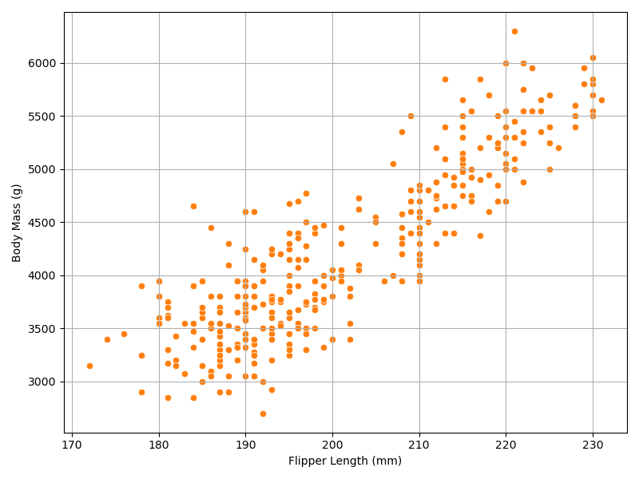

Supervised Learning (II): Regression
====================================

.. questions::

   - why 

.. objectives::

   - Explain 

.. instructor-note::

   - 40 min teaching
   - 40 min exercises

Regression is a type of supervised ML task where the goal is to predict a continuous numerical value based on input features. Unlike classification, which assigns inputs to discrete categories, regression models output real-valued predictions.

While the penguins dataset is most commonly used for classification tasks, it can also be used for regression problems by selecting a continuous target variable. For example, we might be interested in predicting a penguin’s body mass based on its physical measurements like bill length, bill depth, flipper length, and other available features.

.. figure:: img/4-penguins-pairplot.png
   :align: center
   :width: 640px

Depending on model construction procedures, in this episode we explore a variety of regression algorithms to predict penguin body mass based on flipper length. These models are chosen to represent different categories of machine learning approaches, from simple to more complex and flexible methods.

- We begin with KNN regression, which makes predictions based on the average of the closest training samples. It’s a non-parametric, instance-based model that captures local patterns in the data.
- Next we apply linear models, such as standard Linear Regression and Regularized Regression, which assume a straight-line relationship between flipper length and body mass. These models are interpretable and efficient, making them a solid baseline for comparison.
- To address possible non-linear trends in the data, we incorporate non-linear models like Polynomial Regression with higher-degree terms and and Support Vector Regression (SVR) with RBF kernels
- Tree-based models, including decision trees, random forests, and gradient boosting, offer a robust alternative by recursively partitioning the feature space or building ensembles to improve accuracy and handle non-linearities effectively
- Finally, we explore neural networks as a universal function approximator, capable of learning intricate relationships but requiring larger datasets and computational resources.

Each model’s performance is rigorously assessed using cross-validated metrics (RMSE (root mean squared error), R²), and the corresponding predictive curve reveals how well they capture the biological allometry between flipper length and body mass.

This tiered approach -- from simple models like linear regression to more complex ones such as random forests and neural networks -- ensures that we balance interpretability with predictive power. By progressing through these levels of model complexity, we aim to identify the most suitable algorithm for accurately predicting penguin body mass from flipper length, while maintaining an understanding of how each model interprets the relationship between features and target.

